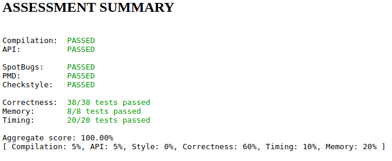

# Percolation
Write a program to estimate the value of the percolation threshold via Monte Carlo simulation. 

[Specification](https://coursera.cs.princeton.edu/algs4/assignments/percolation/specification.php)

### Tests

